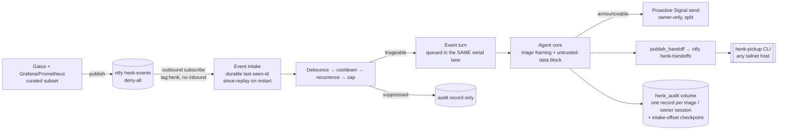

# Henk — "Homie Henk"

A personal homelab agent on the **Claude Agent SDK**, reached over **Signal**,
wired to read-only homelab surfaces. Ask "is everything up?" or "what's on my
todo list?" from your daily messenger; Henk answers using a small, closed
toolset. It doubles as a testbed for agent patterns (tool scoping, approval
flows) that transfer to work.

As of **v1.2 (henk-events)** Henk is also **event-driven**: homelab sensors
(Gatus + a curated Prometheus subset via Grafana) publish to a deny-all ntfy
topic that Henk subscribes to. An incident starts a triage session and an
*unprompted* Signal conversation ending in a triage arc — diagnosis + confidence,
suggested fix, pickup path — that the owner can interrogate. Still **zero
mutations**: every tool is read-only or notify-class.

See `openspec/specs/` (and archived changes under `openspec/changes/archive/`)
for the full design; this README is the operator runbook.

## Security posture (inherited, non-negotiable)

- **Owner-only.** Only the configured owner's DMs are processed; everything else
  (strangers, groups) is dropped silently and logged. Empty/unknown senders can
  never match.
- **Closed toolset.** The agent can call *only* the registered Henk tools. Every
  host-touching SDK built-in is stripped, and a default-deny permission callback
  denies anything not in the registry — so an unknown/built-in tool is refused
  even if the SDK adds new ones.
- **Read-only by default, approval-gated mutations.** v1 ships zero mutating
  tools. The approval gate exists and is tested: any mutating tool is routed
  through inline owner approval (fail-closed on deny/timeout/unrelated), keyed on
  the registry so *registering* a write tool forces gating.
- **Least-privilege network.** Own tailnet identity (`tag:henk`) with egress only
  to the four service ports it uses; no inbound; no SSH.
- **Scoped secrets only.** No `~/.ssh`, no broad API keys, no work/Anamata
  credentials or data (Tier W), ever.

## Architecture


Inbound: bridge → Signal adapter → **allowlist** → **Dispatcher** → (gate routing
if an approval is pending) → **agent core** (serial, one session per
conversation) → SDK turn. Tool calls pass through the **default-deny permission
callback**; reads/notify run, mutations hit the gate. Only the final text reply
is sent back.

### Event flow (v1.2)



Events ride the **existing** `vps:2586` egress — no new port, listener, or
inbound ACL grant (the zero-inbound posture holds). Event payloads enter the
prompt only inside a delimited **untrusted-data block** and never change the
toolset. Three layers keep Signal quiet: a **debounce** window collapses storms
(and replayed backlogs) into one conversation; a per-identity **cooldown**
(with per-pattern overrides — chronic identities like swap carry 24h) drops
re-fires to audit-only; a daily **cap** gates the Signal send only — cap-overflow
incidents still triage, publish a handoff, and get an audit record, and the next
announceable message notes how many were suppressed.

**Triage arc (contract):** every unprompted incident message ends with
(a) a diagnosis + explicit confidence, (b) a suggested fix, (c) a pickup path
referencing the published handoff. The app layer checks arc compliance after
each triage turn and records `triage_arc_complete` — a missing component never
blocks delivery.

**Durability across restarts (event-pipeline-durability).** All event-pipeline
state survives a restart (rp5 restarts are routine and non-graceful), so a
restart no longer silently drops incidents, resets the cadence cap, or loses the
audit trail:

- **Intake offset checkpoint.** The last-seen event id is persisted to a tiny
  `intake-offset` file on the `henk_audit` volume; on startup the subscription
  resumes with `since=<offset>`, so events published *while Henk was stopped*
  (within ntfy's 72h retention) are replayed and collapsed by debounce/cooldown
  into one catch-up conversation. The checkpoint advances **only after** an
  event's outcome is durable — the core writes it at the per-triage-flush site
  gated on the audit write, a suppression-only batch advances it via a marker on
  the same serial queue, and an errored triage records `outcome="error"` before
  advancing. The cursor never moves past an event whose outcome isn't on disk. If
  an audit write genuinely fails, a **durability latch** freezes the cursor for the
  process lifetime (opaque ntfy ids can't be compared, so a gap latches globally)
  and Henk sends a **one-shot Signal notice** that a restart is advised — the
  freeze degrades to a bounded replay-on-restart rather than a silent drop, and it
  is not silent. If ntfy ever *rejects* the persisted cursor (HTTP 400 — it rejects
  anything it cannot parse as a message id, duration, timestamp, or `all`), intake
  falls back to replaying everything still retained rather than retrying a value it
  can never resume from, logs at ERROR and notifies the owner; a cold subscribe is
  deliberately not used, since that would silently discard the downtime events. The
  fallback self-heals on the next event. Only the **first** recovery per process is
  immediate and notifies — a cursor that keeps being rejected is paced by the normal
  backoff and stays silent, so a flapping resume point cannot storm the owner's DMs
  or the (unrotated) audit log.
  Measured 2026-07-24 against the live server: `since=<id>` is **exclusive**, an
  uncached id returns the full cache rather than an error, and retention is 72h.
- **Per-triage audit record.** An event triage writes its audit record at triage
  completion (not deferred to session close), so it survives a SIGKILL and two
  incidents never conflate into one record. Owner sessions still write one record
  on close. This changes record cardinality → the schema is bumped to
  **`schema_version: 2`** (`audit-record.v2.schema.json`; v1 kept for reading old
  records), which also adds `usage.cache_read_input_tokens` for true cost
  accounting under prompt caching.
- **Cadence rehydration.** On startup the cap window, per-identity cooldowns, and
  recurrence handoff refs are reconstructed from the persisted audit log (compared
  on wall-clock time, stable across a restart), so the daily cap and cooldowns
  hold and recurrence framing keeps referencing the prior handoff.
- **Graceful shutdown.** `python -m henk` handles SIGTERM/SIGINT (via
  `loop.add_signal_handler`) so `docker stop`'s grace period flushes the open
  session cleanly instead of escalating to a `Exited 137` SIGKILL.

No new volume, port, or ACL: the checkpoint lives beside the audit log on the
existing `henk_audit` volume (already in the rp5 backup allowlist).

## Repo layout

| Path | What |
|---|---|
| `henk/channel/` | Channel-neutral contract, owner allowlist, Signal adapter (the only Signal-aware module) |
| `henk/gate/` | Approval gate (classification, inline prompt, approve/deny/timeout, fail-closed) |
| `henk/agent/` | Agent core (typed turns, session lifecycle, serial queue, reset/idle), triage framing + arc check, permission decision, SDK wrapper |
| `henk/events/` | Event intake (ntfy subscribe, since-replay), per-source identity derivation, debounce/cooldown/cap pipeline, coordinator |
| `henk/audit/` | Append-only JSONL audit writer + the versioned record **JSON Schema** (the transferable artifact) |
| `henk/tools/` | `homelab_health`, `todo_read`, `notify`, `publish_handoff` (+ deferred `taiga_read`) and the production registry |
| `henk/app.py`, `henk/runtime.py`, `henk/__main__.py` | Composition, production wiring, entrypoint |
| `config.yaml` | Non-secret settings | `.env` | Secrets (git-ignored) |
| `~/.claude-config/bin/henk-pickup` | Pull-based CLI to fetch handoffs from any tailnet host (lives in the claude-config repo) |

## Configuration

**`config.yaml`** (non-secret; see the checked-in sample):

- `owner.id` — the owner identity as Signal reports it (see the deploy-verify note below).
- `signal.bridge_url` / `signal.account` / `signal.safe_length`.
- `agent.model` (default `claude-sonnet-5`), `agent.idle_timeout_seconds` (3600),
  `agent.approval_timeout_seconds` (300), `agent.system_prompt`.
- `endpoints.{gatus,prometheus,todo,ntfy}` base URLs + timeouts; `ntfy.topic`.
  (`endpoints.taiga` is retained but unused in v1.)
- `personal_data.todo_note_allowlist` — **default-deny** list of note-path prefixes
  `todo_read` may surface (folder-boundary match on each todo's source note, e.g.
  `["Personal/"]`). **Empty/unset → the tool surfaces nothing** (fail closed), so a
  forgotten value can never leak work data. The repo default is empty; the real
  prefix lives only in the deployed config. `personal_data.taiga_project_allowlist`
  is pre-shaped for the deferred `taiga_read` fast-follow (unused today).
- `events.*` (v1.2) — `enabled` (**rollback flag**: `false` → subscriber never
  starts, exactly v1), `events_topic`, `handoffs_topic`, `audit_path`,
  `debounce_seconds`, `cooldown_seconds`, `recurrence_window_seconds`,
  `cap_per_24h`, and `cooldown_overrides` (per-pattern regex → seconds). The
  cadence values are informed defaults — tune from the first week's audit log.
  No new keys for durability: the intake-offset checkpoint sits beside
  `audit_path` on the same `henk_audit` volume, and cadence state rehydrates from
  the audit log at that path.
- `events.liveness_deadline_seconds` (135) and
  `endpoints.ntfy.keepalive_interval_seconds` (45) — the intake liveness watchdog.
  The interval records a property of the **ntfy server**; the deadline is
  **Henk's policy** and must be at least 3× it (three consecutive missed
  keepalives), which is validated at load time against Henk's *recorded copy* of
  the interval. **They are coupled:** raising `keepalive-interval` on the ntfy
  server without raising both values here passes validation and then flaps the
  watchdog — reconnect churn and log noise, never lost events. Note
  `endpoints.ntfy.timeout_seconds` (10) is the `notify` tool's POST timeout, not
  the stream read timeout. `events.liveness_report_interval_seconds` (3600) paces
  the healthy-stream log line; lower it temporarily if you want a faster
  post-deploy confirmation than one hour.

**`.env`** (secrets, `chmod 600`, never committed — see `.env.example`):
`CLAUDE_CODE_OAUTH_TOKEN` (or `ANTHROPIC_API_KEY`), `TS_AUTHKEY`, `NTFY_TOKEN`,
`TODO_TOKEN` (optional). `NTFY_TOKEN` is a **single** credential scoped per-topic
server-side (design D3): publish on the notify topic, read on `henk-events`,
publish on `henk-handoffs`.

## Tools (v1)

| Tool | Class | Backend |
|---|---|---|
| `homelab_health` | read-only | Gatus API (rp5:8080) + Prometheus HTTP API (vps:9090) over the tailnet — no SSH |
| `todo_read` | read-only | obsidian-todo-api (vps:8089), GET only; **default-deny note-path allowlist** (`personal_data.todo_note_allowlist`) — surfaces only allowlisted personal notes, drops everything else in-process; empty allowlist → surfaces nothing |
| `notify` | notify-only | ntfy (vps:2586), fixed topic, every message prefixed `[AI]`, no destination arg |
| `publish_handoff` | notify-only | ntfy (vps:2586), fixed `henk-handoffs` topic, `[AI]`-prefixed, no destination arg; returns the message id |

`taiga_read` is implemented and tested but **deferred to v1.1** — the Taiga
instance holds mixed personal/work data and needs a dedicated project-scoped
account first.

### Retrieving handoffs — `henk-pickup`

For every triaged incident Henk publishes a full handoff (trigger, evidence,
diagnosis + confidence, fix, pickup) to the deny-all `henk-handoffs` topic. From
any tailnet host:

```bash
henk-pickup            # print the most recent handoff
henk-pickup --list     # every handoff within ntfy's retention window (72h)
henk-pickup --json     # raw ntfy JSON
```

Credential: a read-only `henk-handoffs` token from `$HENK_PICKUP_TOKEN` or
`~/.config/henk/pickup-token`. Pull-based, no daemon. Handoffs are working notes
(retention-bounded); the `henk_audit` log is the durable record.

## Local development

```bash
uv sync                 # core + dev deps (the SDK is a separate `runtime` extra)
uv run pytest -q        # full suite
```

The Claude Agent SDK is not needed to run the tests: agent-core is exercised with
the SDK mocked, and the permission/closed-toolset logic is tested directly.

## Deploy runbook (rp5)

Prerequisites: the `tag:henk` ACL PR is **merged**; the VPS `obsidian-todo-api`
is reachable on the tailnet (see `henk-vps-setup.sh`); tokens minted.

1. **Clone** to `/home/pi/Coding/henk/` on rp5.
2. **Config + secrets:** edit `config.yaml`; `cp .env.example .env`, fill it,
   `chmod 600 .env`. Put the topic secret in `config.yaml` and the ntfy token in `.env`.
3. **Tailscale key:** generate a pre-authorized `tag:henk` key → `TS_AUTHKEY`.
4. **Bring up:** `docker compose up -d --build`.
5. **Tailnet Lock:** the new node needs signing — from rp5 (a signing node):
   `tailscale lock sign <node-key>` (node key from `tailscale status` / console).
6. **Register Signal** (see below).
7. **Smoke test** (see the checklist).

### Signal registration

Henk uses a **dedicated number** (the secondary SIM), not a linked device.
Registering signal-cli with it **deregisters Signal on the old phone** — expected;
retire that app, never re-register it there.

```bash
# register (SMS or voice), then verify with the code received:
docker exec -it signal-cli-rest-api \
  curl -X POST http://localhost:8080/v1/register/<NUMBER> -d '{"use_voice": false}'
docker exec -it signal-cli-rest-api \
  curl -X POST http://localhost:8080/v1/register/<NUMBER>/verify/<CODE>
```

Set `signal.account` in `config.yaml` to `<NUMBER>`.

### Deploy-verify checklist (must confirm on deploy day)

- [ ] **Owner identity** — send a DM from the owner and confirm Henk replies. If
  it's silent, `owner.id` doesn't match the field Signal reports (UUID vs number,
  see `signal.py` DEPLOY-VERIFY). Fix `owner.id`; **do not** loosen the match.
- [ ] **Stranger silence** — a non-owner DM gets no reply (log shows the drop).
- [ ] **Group ignored** — a group message (even containing the owner) is dropped.
- [ ] **Closed toolset** — confirm a built-in (e.g. asking Henk to "run a shell
  command") is refused; verify no built-in is callable in the real SDK session.
- [ ] **Each tool** answers a real question.
- [ ] **Bridge private** — the signal bridge port is unreachable from host/LAN/tailnet.
- [ ] **ACL scope** — an out-of-scope tailnet port (e.g. `vps:5432`) is blocked;
  `tag:server:8000` (taiga-mcp) is blocked.
- [ ] **Backup** — the `signal-cli-config` **and `henk_audit`** volumes are in
  the rp5 backup routine (`pi5-backup.sh` `BACKUP_VOLUMES`); state survives
  `compose down && up`.

### Deploy-verify checklist (v1.2 events — deploy day)

- [ ] **Gatus → Signal** — a synthetic Gatus failure produces an unprompted
  message with the full triage arc.
- [ ] **Grafana → Signal** — a Grafana test-fire does the same.
- [ ] **Storm → one conversation** — ~10 events within the debounce window yield
  a single conversation.
- [ ] **Hostile payload** — an event whose body contains instruction-like text
  causes **no** out-of-registry tool call (check the transcript/audit).
- [ ] **Restart mid-stream** — an event published while Henk is down is triaged
  exactly once on reconnect (`since` replay), not re-storming.
- [ ] **Deny-all** — anonymous publish to `henk-events` and `henk-handoffs` is
  rejected.
- [ ] **henk-pickup** retrieves the handoff from the workstation.
- [ ] **Zero new exposure** — ACL/ports audit shows no change vs v1.

### Deploy-verify checklist (durability — deploy day)

- [ ] **Restart mid-stream + audit** — publish an event while Henk is stopped,
  restart within retention → triaged **exactly once** and its **audit record is
  present** after restart (this is the defect that motivated the change).
- [ ] **Cap persists** — reach the daily cap, restart, publish another triageable
  event → triaged + handed off but **no Signal send** (cap held across restart).
- [ ] **Cooldown persists** — triage an identity, restart, re-fire within cooldown
  → suppressed, suppression audit record present.
- [ ] **Graceful stop** — `docker stop` exits cleanly (no `Exited 137`) and the
  open session's record is flushed.
- [ ] **Cache-read usage** — a fresh triage's audit record carries a populated
  `cache_read_input_tokens`.
- [ ] **Retention-eviction probe** — probe ntfy's response to a `since` id older
  than the 72h retention window and **define the fallback** (cold-resubscribe vs
  error-and-hold) before trusting it. The design is correct either way (persisting
  conditions re-alert — an accepted non-goal), but ntfy's eviction behaviour is
  unspecified. The durability latch's restart-advice notice shrinks the window in
  which a frozen cursor could age out of retention.
- [ ] **No new surface** — checkpoint file is `intake-offset` on the existing
  `henk_audit` volume; ACL/ports/volumes audit shows no change vs v1.2.

## Rollback

```bash
docker compose down          # stop the stack
# revert the ACL PR to remove tag:henk if fully backing out
```

**Events-only rollback:** set `events.enabled: false` in `config.yaml` and
`compose up -d` — the subscriber never starts and Henk behaves exactly as v1
(no schema/data to unwind; the new topics are inert if unused). The
`intake-offset` checkpoint and v2 audit records are inert if unused and
forward-compatible: reverting to the prior image only over-replays within the
retention window, which cooldown absorbs, and v1 readers still validate old
records.

Rolling back leaves no residue beyond the named volumes; the ntfy grants and
Tailscale node can be removed from their respective admin surfaces.

## Cost

v1 was interactive-only; v1.2 adds event-triggered triage sessions. Token spend
is bounded upstream by the curated sensor list, the debounce window, and per-alert
cooldown (the cadence cap bounds *message* volume, not tokens). SDK usage draws
from the normal subscription limits (the mooted separate credit pool was cancelled
2026-06-15). Watch `/usage` the first week; drop `agent.model` to Haiku via
`config.yaml` if it crowds the allowance.
