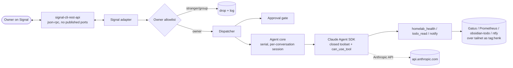

# Henk — "Homie Henk"

A personal homelab agent on the **Claude Agent SDK**, reached over **Signal**,
wired to read-only homelab surfaces. Ask "is everything up?" or "what's on my
todo list?" from your daily messenger; Henk answers using a small, closed
toolset. It doubles as a testbed for agent patterns (tool scoping, approval
flows) that transfer to work.

See `openspec/changes/henk-v1/` for the full design; this README is the operator
runbook.

## Security posture (inherited, non-negotiable)

- **Owner-only.** Only the configured owner's DMs are processed; everything else
  (strangers, groups) is dropped silently and logged. Empty/unknown senders can
  never match.
- **Closed toolset.** The agent can call *only* the registered Henk tools. Every
  host-touching SDK built-in is stripped, and a default-deny permission callback
  denies anything not in the registry — so an unknown/built-in tool is refused
  even if the SDK adds new ones.
- **Read-only by default, approval-gated mutations.** v1 ships zero mutating
  tools. The approval gate exists and is tested: any mutating tool is routed
  through inline owner approval (fail-closed on deny/timeout/unrelated), keyed on
  the registry so *registering* a write tool forces gating.
- **Least-privilege network.** Own tailnet identity (`tag:henk`) with egress only
  to the four service ports it uses; no inbound; no SSH.
- **Scoped secrets only.** No `~/.ssh`, no broad API keys, no work/Anamata
  credentials or data (Tier W), ever.

## Architecture



Inbound: bridge → Signal adapter → **allowlist** → **Dispatcher** → (gate routing
if an approval is pending) → **agent core** (serial, one session per
conversation) → SDK turn. Tool calls pass through the **default-deny permission
callback**; reads/notify run, mutations hit the gate. Only the final text reply
is sent back.

## Repo layout

| Path | What |
|---|---|
| `henk/channel/` | Channel-neutral contract, owner allowlist, Signal adapter (the only Signal-aware module) |
| `henk/gate/` | Approval gate (classification, inline prompt, approve/deny/timeout, fail-closed) |
| `henk/agent/` | Agent core (session lifecycle, serial queue, reset/idle), permission decision, SDK wrapper |
| `henk/tools/` | `homelab_health`, `todo_read`, `notify` (+ deferred `taiga_read`) and the production registry |
| `henk/app.py`, `henk/runtime.py`, `henk/__main__.py` | Composition, production wiring, entrypoint |
| `config.yaml` | Non-secret settings | `.env` | Secrets (git-ignored) |

## Configuration

**`config.yaml`** (non-secret; see the checked-in sample):

- `owner.id` — the owner identity as Signal reports it (see the deploy-verify note below).
- `signal.bridge_url` / `signal.account` / `signal.safe_length`.
- `agent.model` (default `claude-sonnet-5`), `agent.idle_timeout_seconds` (3600),
  `agent.approval_timeout_seconds` (300), `agent.system_prompt`.
- `endpoints.{gatus,prometheus,todo,ntfy}` base URLs + timeouts; `ntfy.topic`.
  (`endpoints.taiga` is retained but unused in v1.)

**`.env`** (secrets, `chmod 600`, never committed — see `.env.example`):
`CLAUDE_CODE_OAUTH_TOKEN` (or `ANTHROPIC_API_KEY`), `TS_AUTHKEY`, `NTFY_TOKEN`,
`TODO_TOKEN` (optional).

## Tools (v1)

| Tool | Class | Backend |
|---|---|---|
| `homelab_health` | read-only | Gatus API (rp5:8080) + Prometheus HTTP API (vps:9090) over the tailnet — no SSH |
| `todo_read` | read-only | obsidian-todo-api (vps:8089), GET only |
| `notify` | notify-only | ntfy (vps:2586), fixed topic, every message prefixed `[AI]`, no destination arg |

`taiga_read` is implemented and tested but **deferred to v1.1** — the Taiga
instance holds mixed personal/work data and needs a dedicated project-scoped
account first.

## Local development

```bash
uv sync                 # core + dev deps (the SDK is a separate `runtime` extra)
uv run pytest -q        # full suite
```

The Claude Agent SDK is not needed to run the tests: agent-core is exercised with
the SDK mocked, and the permission/closed-toolset logic is tested directly.

## Deploy runbook (rp5)

Prerequisites: the `tag:henk` ACL PR is **merged**; the VPS `obsidian-todo-api`
is reachable on the tailnet (see `henk-vps-setup.sh`); tokens minted.

1. **Clone** to `/home/pi/Coding/henk/` on rp5.
2. **Config + secrets:** edit `config.yaml`; `cp .env.example .env`, fill it,
   `chmod 600 .env`. Put the topic secret in `config.yaml` and the ntfy token in `.env`.
3. **Tailscale key:** generate a pre-authorized `tag:henk` key → `TS_AUTHKEY`.
4. **Bring up:** `docker compose up -d --build`.
5. **Tailnet Lock:** the new node needs signing — from rp5 (a signing node):
   `tailscale lock sign <node-key>` (node key from `tailscale status` / console).
6. **Register Signal** (see below).
7. **Smoke test** (see the checklist).

### Signal registration

Henk uses a **dedicated number** (the secondary SIM), not a linked device.
Registering signal-cli with it **deregisters Signal on the old phone** — expected;
retire that app, never re-register it there.

```bash
# register (SMS or voice), then verify with the code received:
docker exec -it signal-cli-rest-api \
  curl -X POST http://localhost:8080/v1/register/<NUMBER> -d '{"use_voice": false}'
docker exec -it signal-cli-rest-api \
  curl -X POST http://localhost:8080/v1/register/<NUMBER>/verify/<CODE>
```

Set `signal.account` in `config.yaml` to `<NUMBER>`.

### Deploy-verify checklist (must confirm on deploy day)

- [ ] **Owner identity** — send a DM from the owner and confirm Henk replies. If
  it's silent, `owner.id` doesn't match the field Signal reports (UUID vs number,
  see `signal.py` DEPLOY-VERIFY). Fix `owner.id`; **do not** loosen the match.
- [ ] **Stranger silence** — a non-owner DM gets no reply (log shows the drop).
- [ ] **Group ignored** — a group message (even containing the owner) is dropped.
- [ ] **Closed toolset** — confirm a built-in (e.g. asking Henk to "run a shell
  command") is refused; verify no built-in is callable in the real SDK session.
- [ ] **Each tool** answers a real question.
- [ ] **Bridge private** — the signal bridge port is unreachable from host/LAN/tailnet.
- [ ] **ACL scope** — an out-of-scope tailnet port (e.g. `vps:5432`) is blocked;
  `tag:server:8000` (taiga-mcp) is blocked.
- [ ] **Backup** — the `signal-cli-config` volume is in the rp5 backup routine;
  Signal state survives `compose down && up`.

## Rollback

```bash
docker compose down          # stop the stack
# revert the ACL PR to remove tag:henk if fully backing out
```

Rolling back leaves no residue beyond the two named volumes; the ntfy user and
Tailscale node can be removed from their respective admin surfaces.

## Cost

v1 is interactive-only and light; SDK usage draws from the normal subscription
limits (the mooted separate credit pool was cancelled 2026-06-15). Watch `/usage`
the first week; drop `agent.model` to Haiku via `config.yaml` if it crowds the
allowance.
