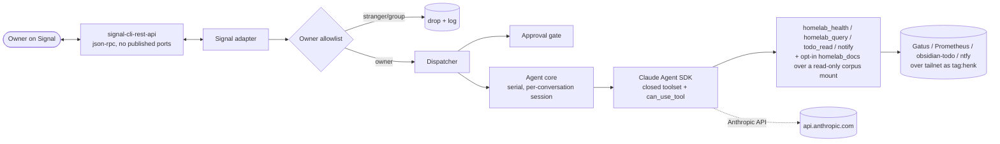
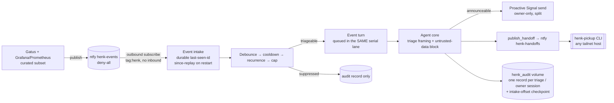

# Henk — "Homie Henk"

A personal homelab agent on the **Claude Agent SDK**, reached over **Signal**,
wired to read-only homelab surfaces plus his own durable memory and capture inbox.
Ask "is everything up?" or "what's on my todo list?" from your daily messenger;
Henk answers using a small, closed toolset. It doubles as a testbed for agent
patterns (tool scoping, authorization tiers, approval flows) that transfer to
work.

As of **v1.2 (henk-events)** Henk is also **event-driven**: homelab sensors
(Gatus + a curated Prometheus subset via Grafana) publish to a deny-all ntfy
topic that Henk subscribes to. An incident starts a triage session and an
*unprompted* Signal conversation ending in a triage arc — diagnosis + confidence,
suggested fix, pickup path — that the owner can interrogate.

As of **memory-capture** Henk has state that outlives a conversation: a capped
store of short facts recalled into every owner conversation, and a durable capture
inbox. These are his first **mutating** tools, both at the *standing* tier —
they act without asking, and every call leaves a durable receipt in the audit log.
Both are **owner-turn-only**: they are refused during incident triage and in any
conversation an incident has touched.

As of **reminders-core + reminder-delivery** Henk keeps time. `/remind +2h call
the plumber` stores a reminder against a resolved absolute instant — DST-correct,
with the resolved time echoed back so a mis-read one is visible in the same reply
— and a polling scheduler delivers it verbatim when it comes due, with no session,
no model turn and no tokens. Downtime is handled rather than lost: a reminder
missed while Henk was down is delivered late stating its original due time if it
is still within the grace window, and named in a catch-up summary if it is not.
Duplicate delivery is the accepted failure mode; silent loss is not. The
capability ships **disabled** (`reminders.enabled`), because a build that accepts
a promise it cannot keep is worse than one that declines it.

See `openspec/specs/` (and archived changes under `openspec/changes/archive/`)
for the full design; this README is the operator runbook.

## Security posture (inherited, non-negotiable)

- **Owner-only.** Only the configured owner's DMs are processed; everything else
  (strangers, groups) is dropped silently and logged. Empty/unknown senders can
  never match.
- **Closed toolset.** The agent can call *only* the registered Henk tools. Every
  host-touching SDK built-in is stripped, and a default-deny permission callback
  denies anything not in the registry — so an unknown/built-in tool is refused
  even if the SDK adds new ones.
- **Two-axis authorization for every mutation.** A mutating tool declares, in
  code, an **authorization tier** — `standing` (executes without prompting,
  receipt always) or `per-instance` (inline owner approval, fail-closed on
  deny/timeout/unrelated/busy) — and a **turn scope** (owner-only by default).
  The third tier, *never*, is simply not being registered. The registry refuses a
  mutating tool missing either declaration, so *registering* a write tool forces
  the gate. Configuration can only **narrow** (`gate.demote_standing` demotes
  every standing action to per-instance); nothing in config can widen a tier,
  widen a scope, or register a tool.
- **Untrusted input can never drive a write.** A session that has processed an
  event turn is *tainted* for its lifetime: an owner-turn-only mutation is denied
  in that session even on owner turns, because a write persists into every future
  conversation while a misleading reply misleads once, visibly. Reads (memory
  recall, `inbox_read`) stay allowed there — Henk's outputs are structurally
  owner-only. Owner commands are exempt: they never pass through the model.
- **Receipts, not just prompts.** Every authorization decision — standing,
  approved, denied, cancelled, timed out, suppressed, out-of-scope, rejected-busy
  — is appended to the audit log *at decision time*, independent of graceful
  shutdown and of whether event intake is enabled. Mutating owner commands write
  one too. An agent that acts without asking is more accountable, not less.
- **Least-privilege network.** Own tailnet identity (`tag:henk`) with egress only
  to the four service ports it uses; no inbound; no SSH.
- **Scoped secrets only.** No `~/.ssh`, no broad API keys, no work/Anamata
  credentials or data (Tier W), ever.

## Architecture


```mermaid
flowchart LR
  owner([Owner on Signal]) <--> bridge[signal-cli-rest-api\njson-rpc, no published ports]
  bridge <--> adapter[Signal adapter]
  adapter --> allow{Owner allowlist}
  allow -- stranger/group --> drop[(drop + log)]
  allow -- owner --> disp[Dispatcher]
  disp --> gate[Approval gate]
  disp --> core[Agent core\nserial, per-conversation session]
  core --> sdk[Claude Agent SDK\nclosed toolset + can_use_tool]
  sdk --> tools[homelab_health / homelab_query / todo_read / notify\n+ opt-in homelab_docs over a read-only corpus mount]
  tools --> homelab[(Gatus / Prometheus / obsidian-todo / ntfy\nover tailnet as tag:henk)]
  sdk -. Anthropic API .-> anthropic[(api.anthropic.com)]
```

Inbound: bridge → Signal adapter → **allowlist** → **Dispatcher** → (gate routing
if an approval is pending) → **agent core** (serial, one session per
conversation) → SDK turn. Tool calls pass through the **default-deny permission
callback**; reads/notify run, mutations hit the gate. Only the final text reply
is sent back.

### Event flow (v1.2)


```mermaid
flowchart LR
  sensors[Gatus + Grafana/Prometheus\ncurated subset] -- publish --> topic[(ntfy henk-events\ndeny-all)]
  topic -- outbound subscribe\ntag:henk, no inbound --> intake[Event intake\ndurable last-seen-id\nsince-replay on restart]
  intake --> pipe[Debounce → cooldown → recurrence → cap]
  pipe -- triageable --> et[Event turn\nqueued in the SAME serial lane]
  pipe -- suppressed --> supp[(audit record only)]
  et --> core2[Agent core\ntriage framing + untrusted-data block]
  core2 -- announceable --> proactive[Proactive Signal send\nowner-only, split]
  core2 --> handoff[publish_handoff → ntfy henk-handoffs] --> pickup[[henk-pickup CLI\nany tailnet host]]
  core2 --> audit[(henk_audit volume\none record per triage / owner session\n+ intake-offset checkpoint)]
```

Events ride the **existing** `vps:2586` egress — no new port, listener, or
inbound ACL grant (the zero-inbound posture holds). Event payloads enter the
prompt only inside a delimited **untrusted-data block** and never change the
toolset. Three layers keep Signal quiet: a **debounce** window collapses storms
(and replayed backlogs) into one conversation; a per-identity **cooldown**
(with per-pattern overrides — chronic identities like swap carry 24h) drops
re-fires to audit-only; a daily **cap** gates the Signal send only — cap-overflow
incidents still triage, publish a handoff, and get an audit record, and the next
announceable message notes how many were suppressed.

**Unprompted messages are exactly two classes, and nothing else** (the cadence
amendment `reminder-delivery` settled): announceable incidents, capped and
condition-triggered as above; and **owner-scheduled reminder deliveries**, which
are not a timer in the banned sense — a reminder message exists because the owner
asked for that message, at that time, in their own words, so it is owner-initiated
content whose delivery moment happens to be deferred. Reminder deliveries and
their catch-up summaries do **not** consume the incident cap; they are bounded
instead by the reminders capability's own pending cap. System-scheduled digests,
heartbeats and "all is well" messages remain banned in so many words — with
nothing scheduled and nothing wrong, Henk sends nothing at all.

**Triage arc (contract):** every unprompted incident message ends with
(a) a diagnosis + explicit confidence, (b) a suggested fix, (c) a pickup path
referencing the published handoff. The app layer checks arc compliance after
each triage turn and records `triage_arc_complete` — a missing component never
blocks delivery.

**Durability across restarts (event-pipeline-durability).** All event-pipeline
state survives a restart (rp5 restarts are routine and non-graceful), so a
restart no longer silently drops incidents, resets the cadence cap, or loses the
audit trail:

- **Intake offset checkpoint.** The last-seen event id is persisted to a tiny
  `intake-offset` file on the `henk_audit` volume; on startup the subscription
  resumes with `since=<offset>`, so events published *while Henk was stopped*
  (within ntfy's 72h retention) are replayed and collapsed by debounce/cooldown
  into one catch-up conversation. The checkpoint advances **only after** an
  event's outcome is durable — the core writes it at the per-triage-flush site
  gated on the audit write, a suppression-only batch advances it via a marker on
  the same serial queue, and an errored triage records `outcome="error"` before
  advancing. The cursor never moves past an event whose outcome isn't on disk. If
  an audit write genuinely fails, a **durability latch** freezes the cursor for the
  process lifetime (opaque ntfy ids can't be compared, so a gap latches globally)
  and Henk sends a **one-shot Signal notice** that a restart is advised — the
  freeze degrades to a bounded replay-on-restart rather than a silent drop, and it
  is not silent. If ntfy ever *rejects* the persisted cursor (HTTP 400 — it rejects
  anything it cannot parse as a message id, duration, timestamp, or `all`), intake
  falls back to replaying everything still retained rather than retrying a value it
  can never resume from, logs at ERROR and notifies the owner; a cold subscribe is
  deliberately not used, since that would silently discard the downtime events. The
  fallback self-heals on the next event. Only the **first** recovery per process is
  immediate and notifies — a cursor that keeps being rejected is paced by the normal
  backoff and stays silent, so a flapping resume point cannot storm the owner's DMs
  or the (unrotated) audit log.
  Measured 2026-07-24 against the live server: `since=<id>` is **exclusive**, an
  uncached id returns the full cache rather than an error, and retention is 72h.
- **Per-triage audit record.** An event triage writes its audit record at triage
  completion (not deferred to session close), so it survives a SIGKILL and two
  incidents never conflate into one record. Owner sessions still write one record
  on close. This changes record cardinality → the schema is bumped to
  **`schema_version: 2`** (`audit-record.v2.schema.json`; v1 kept for reading old
  records), which also adds `usage.cache_read_input_tokens` for true cost
  accounting under prompt caching.
- **Cadence rehydration.** On startup the cap window, per-identity cooldowns, and
  recurrence handoff refs are reconstructed from the persisted audit log (compared
  on wall-clock time, stable across a restart), so the daily cap and cooldowns
  hold and recurrence framing keeps referencing the prior handoff.
- **Graceful shutdown.** `python -m henk` handles SIGTERM/SIGINT (via
  `loop.add_signal_handler`) so `docker stop`'s grace period flushes the open
  session cleanly instead of escalating to a `Exited 137` SIGKILL.

No new volume, port, or ACL: the checkpoint lives beside the audit log on the
existing `henk_audit` volume (already in the rp5 backup allowlist).

## Repo layout

| Path | What |
|---|---|
| `henk/channel/` | Channel-neutral contract, owner allowlist, Signal adapter (the only Signal-aware module) |
| `henk/gate/` | Authorization gate (tiers, turn scope + session taint, resolve-then-confirm prompt, fail-closed concurrency, decision receipts) |
| `henk/agent/` | Agent core (typed turns, session lifecycle, serial queue, reset/idle, gate framing), owner-command dispatch, memory recall, triage framing + arc check, permission decision, SDK wrapper |
| `henk/events/` | Event intake (ntfy subscribe, since-replay), per-source identity derivation, debounce/cooldown/cap pipeline, coordinator |
| `henk/audit/` | Append-only JSONL audit writer, decision-time mutation receipts, + the versioned record **JSON Schema** (the transferable artifact) |
| `henk/store/` | One SQLite file on the audit volume: capped memory repository, capture inbox behind the swappable `InboxStore` seam, reminders repository + the explicit transaction boundary |
| `henk/reminders/` | Time resolution (DST-correct, zone-explicit), the polling delivery scheduler, and the delivered-reminder note |
| `henk/tools/` | `homelab_health`, `homelab_query` (+ its reviewable `query_registry`, renderers, and the address projection), `homelab_docs` (corpus sectioniser, allowlisted index, stamp reader), `sessions_read` (two-stage topic poll, label gate, shape-constrained render; `backend_failure` holds the shared backend-failure sentences), `todo_read`, `notify`, `publish_handoff`, `store_memory`, `capture`, `inbox_read`, `remind`, `cancel_reminder`, `reminders_read` (+ deferred `taiga_read`) and the production registry |
| `henk/replay/` | Triage recording (bounded, beside the audit log), the first-case capture script, and the owner-run replay entry point (`python -m henk.replay`: stub registry, refusing transport, null channel, reconstructed-case serving, run writer, `compare`, and `grade` with its versioned rubric and no-tool judge) |
| `henk/app.py`, `henk/runtime.py`, `henk/__main__.py` | Composition, production wiring, entrypoint |
| `deploy/session-publisher/` | The **workstation** session publisher (stdlib-only Python 3.11+, systemd user timer, example config, README) — committed here, tested by this suite, deliberately **not** in the image |
| `config.yaml` | Non-secret settings | `.env` | Secrets (git-ignored) |
| `~/.claude-config/bin/henk-pickup` | Pull-based CLI to fetch handoffs from any tailnet host (lives in the claude-config repo) |

## Configuration

**`config.yaml`** (non-secret; see the checked-in sample):

- `owner.id` — the owner identity as Signal reports it (see the deploy-verify note below).
- `signal.bridge_url` / `signal.account` / `signal.safe_length`.
- `agent.model` (default `claude-sonnet-5`), `agent.effort` (`high`; `low`–`max`, or
  null for the CLI default), `agent.thinking` (`adaptive` or `disabled`),
  `agent.idle_timeout_seconds` (3600),
  `agent.approval_timeout_seconds` (300), `agent.system_prompt`.
- `agent.event_model` / `agent.event_effort` / `agent.event_thinking` (triage-quality) —
  the **triage profile** for sessions started by an event turn. Each absent key takes the
  chat value above, so shipping them absent (the repo default) changes nothing. An
  explicit null on `event_effort` or `event_thinking` defers to the CLI, which is not
  the same as absent; a null `event_model` is refused. Opus 5.5 rejects disabled
  thinking, which is why `event_thinking` exists.
- `triage_recording.enabled` (true) — the **rollback flag** for triage recording. It is
  the only key: the directory derives from `audit.path`, and the bounds are code
  constants. Any other key under it is refused at startup.
- `replay.judge_model` (`claude-fable-5-1`) / `replay.judge_effort` (`high`) — the replay
  judge, used only by the owner-run `python -m henk.replay grade`, never by the live
  process. A null `judge_effort` is refused.
- `endpoints.{gatus,prometheus,todo,ntfy}` base URLs + timeouts; `ntfy.topic`.
  (`endpoints.taiga` is retained but unused in v1.)
- `personal_data.todo_note_allowlist` — **default-deny** list of note-path prefixes
  `todo_read` may surface (folder-boundary match on each todo's source note, e.g.
  `["Personal/"]`). **Empty/unset → the tool surfaces nothing** (fail closed), so a
  forgotten value can never leak work data. The repo default is empty; the real
  prefix lives only in the deployed config. `personal_data.taiga_project_allowlist`
  is pre-shaped for the deferred `taiga_read` fast-follow (unused today).
- `events.*` (v1.2) — `enabled` (**rollback flag**: `false` → subscriber never
  starts, exactly v1), `events_topic`, `handoffs_topic`, `audit_path`,
  `debounce_seconds`, `cooldown_seconds`, `recurrence_window_seconds`,
  `cap_per_24h`, and `cooldown_overrides` (per-pattern regex → seconds). The
  cadence values are informed defaults — tune from the first week's audit log.
  No new keys for durability: the intake-offset checkpoint sits beside
  `audit_path` on the same `henk_audit` volume, and cadence state rehydrates from
  the audit log at that path.
- `store.*` — `path` (the SQLite file, **inside** the `henk_audit` mount at
  `/data/audit/` so it rides the existing backup allowlist and survives container
  recreation), `memory_pinned_cap` (50), `memory_agent_cap` (20),
  `fact_length_limit` (500), `recall_render_limit` (8000 chars ≈ 2k tokens — when
  it bites, the oldest facts are left out of the *render* with a count and nothing
  is deleted), `inbox_page_size` (20). The same file holds the **handoff archive**
  (triage-quality), which feeds the related-handoff digest: at most 500 handoffs, 90 days
  and 32 KB each, all code constants.
- `homelab_query.*` (read-depth) — `enabled` (**defaults to true**; the tool rides the
  same `tag:henk` egress as `homelab_health` and needs nothing provisioned) and
  `query_range_max_points` (60). It reuses `endpoints.gatus` / `endpoints.prometheus`
  timeouts; there is no separate timeout key and **no key ever holds an address** —
  the DNS node mapping is derived at call time.
- `homelab_docs.*` (read-depth) — `enabled` (**defaults to false**; flipping it is the
  hard stop, as with reminders), `path` (the read-only corpus mount; `enabled` with no
  `path` is a startup error, while a missing/empty/unstamped directory registers the tool
  and fails honestly per call), `stamp_max_age_seconds` (93600 = 26h, bounds the
  **last-pull** time only), `read_byte_budget` (8000), `search_result_count` (5).
- `personal_data.docs_path_allowlist` — **default-deny** list of corpus paths (relative
  to the docs root) `homelab_docs` may index. Filtering happens at index build, so a
  non-allowlisted file yields no candidate and no snippet. **Empty/unset → surfaces
  nothing**, with a diagnostic distinct from "corpus unavailable".
- `sessions.*` (session-awareness) — `enabled` (**defaults to false**; the workstation
  publisher, its write-only ntfy user, Henk's read grant on `henk-sessions`, and the label
  allowlist below must exist first), `topic` (`henk-sessions`; one name — a `,` or `/` is
  refused at load because a comma would silently widen the read to a second topic),
  `stale_after_seconds` (1500 = the publisher's 900 s heartbeat plus two 300 s ticks; also
  the first poll window), `lookback_seconds` (21600 = 6 h; the second poll window, must be
  ≥ the staleness bound). Base URL and timeout are `endpoints.ntfy`'s; there is no new
  secret and no new timeout key.
- `personal_data.session_project_allowlist` — **default-deny** list of the publisher's
  configured **project labels** (never paths) `sessions_read` may list; matched exactly
  after a whitespace strip, blank entries discarded. The workstation estate mixes personal
  and work sessions, so this gate applies even though the publisher already filters.
  **Empty/unset → surfaces nothing** and says so. Enabling on rp5 is a deliberate
  **two-key** edit: this list and `sessions.enabled`, together.
- `reminders.*` — `enabled` (**defaults to false**, and that is the feature: a
  build that confidently accepts "remind me at six" and then says nothing at six
  has spent the owner's trust on a promise it cannot keep). When true it also
  requires `owner.timezone` as a Region/Location zone key — no default and no UTC
  fallback, because a hardcoded zone bakes a personal fact into a public repo and
  a fallback fires every reminder an hour or two off while looking healthy.
  Bounds: `max_pending` (100), `text_length_limit` (500), `horizon_days` (365),
  `clock_skew_tolerance_seconds` (120), `page_size` (20). Delivery bounds:
  `poll_interval_seconds` (30), `retry_floor_seconds` (900),
  `crash_attempt_limit` (3 — attempts the process did not *survive*, distinct
  from the bridge's per-chunk HTTP retry budget), `late_grace_seconds` (86400),
  `late_delivery_threshold_seconds` (300), `report_horizon_seconds` (86400),
  `tick_delivery_limit` (10), `note_window_seconds` (43200), `note_max_items`
  (10). All validated at load, whether or not the flag is on; every key here only
  **narrows** — there is deliberately none for tier, turn scope, or recipient.
- `audit.path` — where the audit log lives. Falls back to `events.audit_path` when
  absent, so a deployed config predating this key keeps working. Audit is now
  constructed unconditionally: `events.enabled: false` no longer disables receipts.
- `gate.demote_standing` (false) — the kill-switch: demotes every standing-tier
  action to per-instance approval. The only gate knob, and it only narrows.
- `events.liveness_deadline_seconds` (135) and
  `endpoints.ntfy.keepalive_interval_seconds` (45) — the intake liveness watchdog.
  The interval records a property of the **ntfy server**; the deadline is
  **Henk's policy** and must be at least 3× it (three consecutive missed
  keepalives), which is validated at load time against Henk's *recorded copy* of
  the interval. **They are coupled:** raising `keepalive-interval` on the ntfy
  server without raising both values here passes validation and then flaps the
  watchdog — reconnect churn and log noise, never lost events. Note
  `endpoints.ntfy.timeout_seconds` (10) is the `notify` tool's POST timeout, not
  the stream read timeout. `events.liveness_report_interval_seconds` (3600) paces
  the healthy-stream log line; lower it temporarily if you want a faster
  post-deploy confirmation than one hour.

**`.env`** (secrets, `chmod 600`, never committed — see `.env.example`):
`CLAUDE_CODE_OAUTH_TOKEN` (or `ANTHROPIC_API_KEY`), `TS_AUTHKEY`, `NTFY_TOKEN`,
`TODO_TOKEN` (optional). `NTFY_TOKEN` is a **single** credential scoped per-topic
server-side (design D3): publish on the notify topic, read on `henk-events`,
publish on `henk-handoffs`.

## Tools

| Tool | Class | Tier / scope | Backend |
|---|---|---|---|
| `homelab_health` | read-only | — | Gatus API (rp5:8080) + Prometheus HTTP API (vps:9090) over the tailnet — no SSH. Since read-depth its bars are the **same threshold objects** `homelab_query` uses (memory > 75 % used, disk < 15 % free on `/`, load reported with no bar), so the two tools cannot disagree |
| `homelab_query` | read-only | — | six **named** queries over the same two backends — `node_resource_trend`, `scrape_targets`, `endpoint_history`, `freshness_check`, `container_state`, `dns_performance` — from a closed, reviewable registry: no free-form PromQL, every parameter a closed enum, every threshold traceable to a live alert rule, and `instance` / `scrapeUrl` / `server` values projected out so no tailnet address reaches a reply. Registered when `homelab_query.enabled` (default true) |
| `homelab_docs` | read-only | — | `search` and `read` over the homelab documentation corpus, delivered as a **read-only bind mount** (no network, no credential in the container). Default-deny path allowlist applied at index build; every result carries the last-pull age and is marked stale past 26 h rather than hidden. Registered only when `homelab_docs.enabled` (default **false**) |
| `sessions_read` | read-only | — | the owner's Claude Code sessions on the **workstation**, as last reported by the workstation-side publisher (`deploy/session-publisher/`) to the deny-all `henk-sessions` ntfy topic (vps:2586, the egress Henk already has). Polls the topic cache at call time — two `poll=1` GETs at most, no subscription, no cursor. Every session is four shape-constrained values (`pane`, configured `project` label, herdr `status`, `age_s`): no path, title, branch, or label ever crosses the machine boundary. Filtering is default-deny **twice** — publisher-side (canonical-path allow/deny roots plus `origin` owner, on both reported paths) and again in Henk by the `personal_data.session_project_allowlist` label gate. Every result opens with the snapshot's age and says when it is stale, absent, or unusable; listed sessions are never presented as all sessions. Registered only when `sessions.enabled` (default **false**) |
| `todo_read` | read-only | — | obsidian-todo-api (vps:8089), GET only; **default-deny note-path allowlist** (`personal_data.todo_note_allowlist`) — surfaces only allowlisted personal notes, drops everything else in-process; empty allowlist → surfaces nothing |
| `notify` | notify-only | — | ntfy (vps:2586), fixed topic, every message prefixed `[AI]`, no destination arg |
| `publish_handoff` | notify-only | — | ntfy (vps:2586), fixed `henk-handoffs` topic, `[AI]`-prefixed, no destination arg; returns the message id |
| `store_memory` | **mutating** | standing / owner-turn-only | one `agent`-type fact into the local SQLite store (cap 20, FIFO); over-limit text is refused, never truncated |
| `capture` | **mutating** | standing / owner-turn-only | appends one item to the local capture inbox (no cap, no eviction); durable before the result says so |
| `inbox_read` | read-only | — | the oldest 20 open inbox items plus a count of any newer |
| `remind` | **mutating** | standing / owner-turn-only | one reminder into the local SQLite store (pending cap 100, refused naming the number); the reply echoes the **resolved** due time with its weekday, so a mis-read time is visible immediately |
| `cancel_reminder` | **mutating** | standing / owner-turn-only | sets one pending reminder to `cancelled`; nothing is ever deleted, so what was asked for survives |
| `reminders_read` | read-only | — | pending reminders, soonest first (page 20) |

`homelab_docs` needs host provisioning that Henk never performs itself: a root-owned
clone of the docs repo on rp5, a daily pull timer that writes the freshness stamp
**after** the content, and the compose mount with host-path auto-creation disabled.
Until the owner flips `homelab_docs.enabled`, the deployed toolset is unchanged apart
from `homelab_query`.

The reminder tools are registered only when `reminders.enabled` is true; with the
capability off they are absent from the toolset entirely and the two commands
below reply that reminders are not configured.

The standing grants are argued on **containment**, not on saved attention: all
are append-only writes into Henk-local stores that cannot leave the container,
all are owner-turn-only, all are receipted, and all are reversible by the owner
(`/forget`, `/inbox done`, `/reminders cancel`). When the planned personal-inbox
service replaces the inbox backend, `capture`'s tier has to be re-litigated —
"cannot leave the container" does not survive that swap.

Rescheduling is deliberately **not** a tool: it is `cancel_reminder` + `remind`,
two calls with two echoes, and the echoes are the safety mechanism. Reinstating
is an owner command only, which is what keeps it subject to the pending cap.

### Owner commands (no agent turn, no tokens)

Handled app-side before any session exists, so they are instant, deterministic,
and work in any conversation state — including mid-incident, where the *tools*
are refused:

| Command | Effect |
|---|---|
| `/new` | Reset the conversation (new session) |
| `/remember <fact>` | Store a `pinned` memory (cap 50, FIFO; eviction is named in the reply) |
| `/forget <text>` | Delete every memory containing `<text>` (case-insensitive) and echo what went, so a mistake is re-addable |
| `/memories` | List every memory with its id and type |
| `/capture <thought>` | Append to the capture inbox, confirming with the item id |
| `/inbox` | Oldest 20 open items + a count of any newer |
| `/inbox all` | Every open item |
| `/inbox done <id>` | Archive one item (it leaves the listings; it is never deleted) |
| `/remind <when> <text>` | Schedule one reminder, echoing the **resolved** due time with its weekday |
| `/reminders` | Pending reminders, soonest first, with their ids |
| `/reminders cancel <id>` | Cancel one pending reminder (a status change, never a delete) |
| `/reminders reinstate <id>` | Return a cancelled reminder to pending, subject to the pending cap |

`/remember`, `/forget`, `/capture`, `/inbox done`, `/remind` and both mutating
`/reminders` verbs write a receipt when they change something. Read-only commands
and no-ops write none.

The reminder commands are present only when `reminders.enabled` is true; with the
capability off they are recognized but reply that reminders are not configured —
recognized rather than unknown, so the reply is honest instead of a silent no-op.

`taiga_read` is implemented and tested but **deferred** — the Taiga
instance holds mixed personal/work data and needs a dedicated project-scoped
account first.

### Retrieving handoffs — `henk-pickup`

For every triaged incident Henk publishes a full handoff (trigger, evidence,
diagnosis + confidence, fix, pickup) to the deny-all `henk-handoffs` topic. From
any tailnet host:

```bash
henk-pickup            # print the most recent handoff
henk-pickup --list     # every handoff within ntfy's retention window (72h)
henk-pickup --json     # raw ntfy JSON
```

Credential: a read-only `henk-handoffs` token from `$HENK_PICKUP_TOKEN` or
`~/.config/henk/pickup-token`. Pull-based, no daemon. Handoffs are working notes
(retention-bounded); the `henk_audit` log is the durable record.

### Replaying a triage — `python -m henk.replay`

Every event triage leaves a bounded recording on the audit volume
(`triage-recordings/`, beside the audit log). The owner can re-run one against another
model, effort and thinking mode, with every tool stubbed: recorded calls get their
recorded answers, anything else gets an explicit "not recorded in this replay", a
handoff or notification is captured into the run file rather than published, and
mutating tools are denied by the same gate as live. No tool can make a network
request, and nothing reaches Signal, ntfy, the audit log or the store. The model call
is the only request a replay makes, and it spends real tokens, so only the owner runs
it.

**Storage and retention.** Recordings are bounded in code at 200 files, 30 days and
256 KB each. A recording's replay and grade outputs (`triage-replays/<id>/`) are removed
along with it, while a reference case's outputs stay with the case. Everything lives on
the `henk_henk_audit` volume and rides its nightly backup, so the effective retention is
up to about 8 weeks: 30 days live, plus the 4-week snapshot rotation. Recordings hold what
the model saw, tool results with tailnet addresses and recalled memory included. Treat
them like the audit log, and never paste one raw.

Run it on rp5 as a one-shot container of the henk service, **from the henk checkout
directory**:

```bash
cd /home/pi/Coding/henk
docker compose run --rm --no-deps -e CLAUDE_CONFIG_DIR=/tmp/henk-replay henk python -m henk.replay list
docker compose run --rm --no-deps -e CLAUDE_CONFIG_DIR=/tmp/henk-replay henk python -m henk.replay run <recording-or-case-id> --model claude-opus-5-5 --effort high
```

- `list` prints each recording's id, time, incident identities, ending, and whether
  it is complete.
- `run <id> --model M --effort E [--thinking T]` replays one recording, or one
  reference case in `triage-cases/`. `M` must look like `claude-<name>` (optionally
  ending `[1m]`), `E` is one of `low`, `medium`, `high`, `xhigh`, `max`, and `T` is
  `adaptive` or `disabled` (left unset when omitted). All three are checked before
  anything else, so a typo spends nothing.
- The run file lands in `triage-replays/<id>/<run-id>.json` on the audit volume. It
  holds the reply, every tool call and how it was answered, captured handoffs, the
  gate's decisions, the unrecorded-call count, token usage and drift. Drift, a system
  prompt or tool definitions that changed since the recording was made, is also
  printed to the terminal.

Comparing and grading runs uses the same invocation:

```bash
docker compose run --rm --no-deps -e CLAUDE_CONFIG_DIR=/tmp/henk-replay henk python -m henk.replay compare <recording-or-case-id> [<run-id> ...]
docker compose run --rm --no-deps -e CLAUDE_CONFIG_DIR=/tmp/henk-replay henk python -m henk.replay grade <recording-or-case-id> [<run-id> ...]
```

- `compare <id> [run-id ...]` prints the original triage beside the named runs (every
  run of it when none is named): model, effort, ending, arc completeness and
  confidence, the arc lines, the start of the handoff, the tool calls in order with
  unrecorded ones marked `NOT RECORDED`, and tokens. It only reads files: no model
  call, no request, nothing written. For a rebuilt case (below), whose original
  reply was not preserved, the original shows the recorded diagnosis and
  confidence and the original handoff instead, and says `reply: not preserved`.
- `grade <id> [run-id ...] [--judge-model M] [--judge-effort E] [--seed N]` has a
  judge with no tools score the original and each run (every run when none is
  named) on the five criteria of the committed rubric,
  `henk/replay/rubric/triage-rubric.v1.md`. The judge runs on `replay.judge_model`
  (default `claude-fable-5-1`) at `replay.judge_effort` (default `high`), with
  thinking unset. The overrides are checked like `run`'s, before anything else. It
  spends real tokens, and needs `CLAUDE_CONFIG_DIR` like `run`.
- The judge is blind: it sees the candidates as `A`, `B`, … in a seeded random order,
  with no model, effort or run id. The seed and which label is which run are written
  to the grade file, and printed, but never sent to the judge. A case carrying a
  verified `reference` is graded against it as ground truth.
- A rebuilt case's original candidate is its original handoff plus the diagnosis and
  confidence the audit record kept; its reply field is a bracketed line the replay
  tool composes, saying the reply was not preserved. An original with no reply, no
  handoff and no recorded diagnosis is refused before the judge runs (a live
  recording that ended `error`, `refused` or `no-reply` is still graded as that
  ending).
- The grade lands in `triage-replays/<id>/grades/<grade-id>.json`, with the rubric
  version and hash, the judge model and effort, the seed, whether a reference was
  used, and per candidate and criterion a score and a one-line reason. When the
  judge's answer does not parse (one enclosing code fence is tolerated; prose around
  it, or a second fence, is not), or its session refused or failed, the grade is still
  written, as `unparseable`, `refused`, `error` or `no-reply`, with the raw text and
  no scores, and `grade` exits 1.

Why this exact invocation:

- **`run --rm`, never `exec`.** The replay gets its own container, cgroup and 768m
  limit. Run by `exec`, its memory would count against the live container's limit
  and could get live Henk OOM-killed.
- **`--no-deps`** starts nothing else. The run shares the running tailscale network
  namespace and publishes no port.
- **`-e CLAUDE_CONFIG_DIR=/tmp/henk-replay`** keeps the bundled CLI's state apart
  from the live process's. `run` refuses to start without it.
- **It must run from the checkout directory.** Compose names the project after the
  directory, so from a copy such as `henk.old` the project becomes `henkold`, with
  brand-new empty volumes. As a guard, the entry point refuses to run when the audit
  log does not exist, naming the path and this cause.

#### Reference cases — `cases` and `rebuild`

A reference case is a directory in `triage-cases/` (beside the audit log) holding a
`case.json`. Nothing else there is a case: raw material and captures have none. At
most 20 cases are kept, and a case is never evicted to make room.

```bash
docker compose run --rm --no-deps -e CLAUDE_CONFIG_DIR=/tmp/henk-replay henk python -m henk.replay cases
docker compose run --rm --no-deps -e CLAUDE_CONFIG_DIR=/tmp/henk-replay henk python -m henk.replay rebuild \
  --events /data/audit/triage-cases/<inputs>/<henk-events cache> \
  --audit-records /data/audit/triage-cases/<inputs>/<audit records> \
  --handoffs /data/audit/triage-cases/<inputs>/<henk-handoffs cache> \
  --capture /data/audit/triage-cases/2026-09-23-capture \
  --reference /data/audit/triage-cases/<inputs>/reference.json \
  --case-prefix 2026-09-23-swap
```

- `cases` prints one line per case: its id, `reconstructed` with its capture time
  and drift count, `live` with its recording id, or `invalid` with the reason (an
  invalid case still counts toward the bound). A directory whose `case.json` cannot
  be read is skipped with a warning.
- `rebuild` builds a reconstructed case for a triage that has no recording, one per
  captured evaluation time `T`, as `<prefix>-T<HHMMSSZ>`, and prints the ids it
  wrote. Paths are the container's, under `/data/audit/`. Its inputs:
  - `--events`: the preserved `henk-events` ntfy cache (JSON Lines). The frames the
    triage record names are composed by the current composer, with no recall block
    and no digest, so neither memory nor history can carry the answer.
  - `--audit-records`: the preserved audit records. The event triage in them gives
    the original call sequence (tool names, arguments `unknown`), the diagnosis, the
    confidence and the handoff id. When they hold more than one event triage, name
    it with `--event-id <ntfy id>`.
  - `--handoffs`: the preserved `henk-handoffs` cache, for the original handoff. If
    ntfy delivered it as an attachment, pass its text with `--handoff-document`.
  - `--capture`: the capture (`python -m henk.replay.capture`), one
    `YYYYMMDDTHHMMSSZ/` directory per `T`. It must lie inside `triage-cases/`,
    because the case refers to it by a relative path and never copies it.
  - `--reference`: the owner's verified ground truth, a JSON object with `branch`,
    `culprit`, `mechanism` and `fix` (non-empty strings) and an optional `notes`.
- Before writing, `rebuild` checks every captured answer against the current
  registry and configuration: expression, kind, `T`, and for a range answer the
  point budget and step. Mismatches are printed as `DRIFT` lines and recorded in the
  case, and a replay does not serve them.
- A `T` outside the triage's interval (notification time plus the debounce, to the
  triage record's time) is refused. An existing case is refused unless `--replace`
  is given. A batch that would pass the bound of 20 writes nothing.
- A rebuilt case grades the **current** renderers' evidence over a re-capture, not
  the evidence the original triage saw. The case, `rebuild` and every `run` of it
  say so.
- `rebuild` spends nothing: it calls no model and makes no network request.
  `cases` and `rebuild` need no `CLAUDE_CONFIG_DIR`, but the same compose form keeps
  one invocation for every command.

## Local development

```bash
uv sync                 # core + dev deps (the SDK is a separate `runtime` extra)
uv run pytest -q        # full suite
```

The Claude Agent SDK is not needed to run the tests: agent-core is exercised with
the SDK mocked, and the permission/closed-toolset logic is tested directly.

## Deploy runbook (rp5)

Prerequisites: the `tag:henk` ACL PR is **merged**; the VPS `obsidian-todo-api`
is reachable on the tailnet (see `henk-vps-setup.sh`); tokens minted.

1. **Clone** to `/home/pi/Coding/henk/` on rp5.
2. **Config + secrets:** edit `config.yaml`; `cp .env.example .env`, fill it,
   `chmod 600 .env`. Put the topic secret in `config.yaml` and the ntfy token in `.env`.
3. **Tailscale key:** generate a pre-authorized `tag:henk` key → `TS_AUTHKEY`.
4. **Bring up:** `docker compose up -d --build`.
5. **Tailnet Lock:** the new node needs signing — from rp5 (a signing node):
   `tailscale lock sign <node-key>` (node key from `tailscale status` / console).
6. **Register Signal** (see below).
7. **Smoke test** (see the checklist).

### Redeploying an existing install

The runbook above is for a first install. For shipping a new commit to a live rp5, the two
things that bite are **ownership** (the checkout is `pi`'s, `docker compose` needs root) and
**`config.yaml`**, which is a genuine uncommitted local modification holding the real
`owner.id`, `signal.account`, and `todo_note_allowlist`. A plain `git pull` refuses whenever
upstream also touched that file.

Back the live config up first, then pull around it:

```bash
su pi -c 'install -m 600 /home/pi/Coding/henk/config.yaml /home/pi/henk-config-live.yaml'
su - pi                                    # interactive shell — see the warning below
cd /home/pi/Coding/henk
git stash push -m live-config -- config.yaml
git pull --ff-only origin main             # type this ALONE; it prompts for the key passphrase
cp /home/pi/henk-config-live.yaml config.yaml
git stash drop
cmp /home/pi/henk-config-live.yaml config.yaml && echo CONFIG-UNCHANGED && git log --oneline -1
exit
docker compose -p henk -f /home/pi/Coding/henk/docker-compose.yml up -d --build henk
```

**`git pull` must be typed interactively, one line at a time.** rp5's git key
(`~/.ssh/id_ed25519_work_pi5`) is passphrase-protected, and neither `su pi -c 'git pull …'` nor
a pasted multi-line block leaves a terminal for the prompt — both fail with a bare
`Permission denied (publickey)` that looks exactly like a wrong or unregistered key.

**`-p henk` is not optional.** Compose derives the project name from the directory, so running
it from anywhere else (or from a copy like `henk.old`) creates a *separate* project on brand-new
**empty** volumes. The symptom is a wall of name-resolution failures, because the fresh
tailscale sidecar has no identity.

**Three tells that a "deploy" silently did nothing** — all three appeared twice on 2026-08-19
when the pull had failed:

| Tell | Meaning |
|---|---|
| `COPY henk ./henk` reported `CACHED` | the source tree is unchanged, so the pull didn't land |
| the image sha matches the previous build | same |
| the container line reads `Running`, not `Started` | compose found nothing to recreate |

A real deploy rebuilds `COPY henk ./henk`, re-runs `pip install` (~15–25s), writes a new image
sha, and prints `Started`. Verify afterwards with a `since=<id>` line in
`docker compose -p henk -f … logs henk` — that proves it attached to the real
`henk_henk_audit` volume rather than an empty one. Keep the previous image (don't prune); it
is the rollback target.

### Signal registration

Henk uses a **dedicated number** (the secondary SIM), not a linked device.
Registering signal-cli with it **deregisters Signal on the old phone** — expected;
retire that app, never re-register it there.

```bash
# register (SMS or voice), then verify with the code received:
docker exec -it signal-cli-rest-api \
  curl -X POST http://localhost:8080/v1/register/<NUMBER> -d '{"use_voice": false}'
docker exec -it signal-cli-rest-api \
  curl -X POST http://localhost:8080/v1/register/<NUMBER>/verify/<CODE>
```

Set `signal.account` in `config.yaml` to `<NUMBER>`.

### Deploy-verify checklist (must confirm on deploy day)

- [ ] **Owner identity** — send a DM from the owner and confirm Henk replies. If
  it's silent, `owner.id` doesn't match the field Signal reports (UUID vs number,
  see `signal.py` DEPLOY-VERIFY). Fix `owner.id`; **do not** loosen the match.
- [ ] **Stranger silence** — a non-owner DM gets no reply (log shows the drop).
- [ ] **Group ignored** — a group message (even containing the owner) is dropped.
- [ ] **Closed toolset** — confirm a built-in (e.g. asking Henk to "run a shell
  command") is refused; verify no built-in is callable in the real SDK session.
- [ ] **Each tool** answers a real question.
- [ ] **Bridge private** — the signal bridge port is unreachable from host/LAN/tailnet.
- [ ] **ACL scope** — an out-of-scope tailnet port (e.g. `vps:5432`) is blocked;
  `tag:server:8000` (taiga-mcp) is blocked.
- [ ] **Backup** — the `signal-cli-config` **and `henk_audit`** volumes are in
  the rp5 backup routine (`pi5-backup.sh` `BACKUP_VOLUMES`); state survives
  `compose down && up`.

### Deploy-verify checklist (v1.2 events — deploy day)

- [ ] **Gatus → Signal** — a synthetic Gatus failure produces an unprompted
  message with the full triage arc.
- [ ] **Grafana → Signal** — a Grafana test-fire does the same.
- [ ] **Storm → one conversation** — ~10 events within the debounce window yield
  a single conversation.
- [ ] **Hostile payload** — an event whose body contains instruction-like text
  causes **no** out-of-registry tool call (check the transcript/audit).
- [ ] **Restart mid-stream** — an event published while Henk is down is triaged
  exactly once on reconnect (`since` replay), not re-storming.
- [ ] **Deny-all** — anonymous publish to `henk-events` and `henk-handoffs` is
  rejected.
- [ ] **henk-pickup** retrieves the handoff from the workstation.
- [ ] **Zero new exposure** — ACL/ports audit shows no change vs v1.

### Deploy-verify checklist (durability — deploy day)

- [ ] **Restart mid-stream + audit** — publish an event while Henk is stopped,
  restart within retention → triaged **exactly once** and its **audit record is
  present** after restart (this is the defect that motivated the change).
- [ ] **Cap persists** — reach the daily cap, restart, publish another triageable
  event → triaged + handed off but **no Signal send** (cap held across restart).
- [ ] **Cooldown persists** — triage an identity, restart, re-fire within cooldown
  → suppressed, suppression audit record present.
- [ ] **Graceful stop** — `docker stop` exits cleanly (no `Exited 137`) and the
  open session's record is flushed.
- [ ] **Cache-read usage** — a fresh triage's audit record carries a populated
  `cache_read_input_tokens`.
- [ ] **Retention-eviction probe** — probe ntfy's response to a `since` id older
  than the 72h retention window and **define the fallback** (cold-resubscribe vs
  error-and-hold) before trusting it. The design is correct either way (persisting
  conditions re-alert — an accepted non-goal), but ntfy's eviction behaviour is
  unspecified. The durability latch's restart-advice notice shrinks the window in
  which a frozen cursor could age out of retention.
- [ ] **No new surface** — checkpoint file is `intake-offset` on the existing
  `henk_audit` volume; ACL/ports/volumes audit shows no change vs v1.2.

## Rollback

```bash
docker compose down          # stop the stack
# revert the ACL PR to remove tag:henk if fully backing out
```

**Events-only rollback:** set `events.enabled: false` in `config.yaml` and
`compose up -d` — the subscriber never starts and Henk behaves exactly as v1
(no schema/data to unwind; the new topics are inert if unused). The
`intake-offset` checkpoint and v2 audit records are inert if unused and
forward-compatible: reverting to the prior image only over-replays within the
retention window, which cooldown absorbs, and v1 readers still validate old
records.

Rolling back leaves no residue beyond the named volumes; the ntfy grants and
Tailscale node can be removed from their respective admin surfaces.

## Cost

v1 was interactive-only; v1.2 adds event-triggered triage sessions. Token spend
is bounded upstream by the curated sensor list, the debounce window, and per-alert
cooldown (the cadence cap bounds *message* volume, not tokens). SDK usage draws
from the normal subscription limits (the mooted separate credit pool was cancelled
2026-06-15). Watch `/usage` the first week; drop `agent.model` to Haiku via
`config.yaml` if it crowds the allowance.
